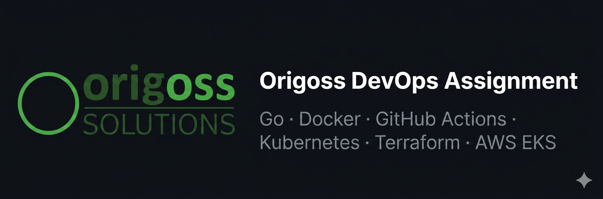
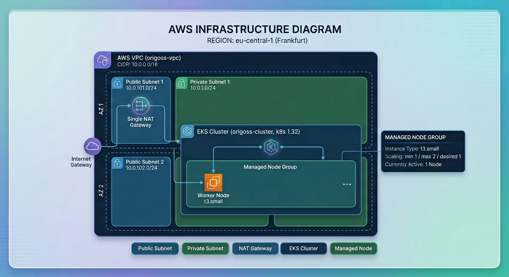

<a id="readme-top"></a>
<br />
<div align="center">
  

<h3 align="center">Origoss DevOps Technical Assignment</h3>

  <p align="center">
    A containerized "Hello, World!" HTTP server — built with Go, shipped via GitHub Actions, and deployed to AWS EKS using Terraform.
    <br />
    <a href="https://github.com/KovyD20/origoss_solutions_project"><strong>Explore the repo »</strong></a>
  </p>
</div>

---

<!-- TABLE OF CONTENTS -->
<details>
  <summary>Table of Contents</summary>
  <ol>
    <li><a href="#about-the-project">About The Project</a></li>
    <li><a href="#built-with">Built With</a></li>
    <li><a href="#project-evolution">Project Evolution</a></li>
    <li>
      <a href="#getting-started">Getting Started</a>
      <ul>
        <li><a href="#prerequisites">Prerequisites</a></li>
        <li><a href="#local-run">Local Run</a></li>
      </ul>
    </li>
    <li>
      <a href="#exercises">Exercises</a>
      <ul>
        <li><a href="#1-go-http-server">1 — Go HTTP Server</a></li>
        <li><a href="#2-docker">2 — Docker</a></li>
        <li><a href="#3-ci-pipeline">3 — CI Pipeline</a></li>
        <li><a href="#4-kubernetes">4 — Kubernetes</a></li>
        <li><a href="#5-terraform--aws-eks">5 — Terraform & AWS EKS</a></li>
      </ul>
    </li>
    <li><a href="#contact">Contact</a></li>
  </ol>
</details>

---

## About The Project

This repository is my solution to the **Origoss DevOps Technical Questionnaire**. It covers five progressive exercises, each building on the previous one:

1. Write a simple HTTP server
2. Dockerize it
3. Set up a CI pipeline
4. Deploy to Kubernetes
5. Automate infrastructure with Terraform

The server itself is intentionally minimal — a single endpoint that returns `Hello, World!`. The focus is entirely on the surrounding DevOps tooling.

<p align="right">(<a href="#readme-top">back to top</a>)</p>

---

## Built With

[![Go][Go-badge]][Go-url]
[![Docker][Docker-badge]][Docker-url]
[![GitHub Actions][GHA-badge]][GHA-url]
[![Kubernetes][K8s-badge]][K8s-url]
[![Terraform][TF-badge]][TF-url]
[![AWS][AWS-badge]][AWS-url]

<p align="right">(<a href="#readme-top">back to top</a>)</p>

---

## Project Evolution

The project went through two major iterations:

| Phase | Backend | Cluster | Notes |
|-------|---------|---------|-------|
| **v1** | Node.js (`http` module, ES modules) | Minikube (local) | Initial implementation |
| **v2** | Go (`net/http` standard library) | AWS EKS | Final, production-ready version |

The Node.js code is preserved under [`archive/js_backend/`](archive/js_backend/) for reference.  
The Terraform configuration was also migrated — originally targeting Minikube via the local Kubernetes context, then rewritten to provision a full VPC + EKS cluster on AWS.

<p align="right">(<a href="#readme-top">back to top</a>)</p>

---

## Getting Started

### Prerequisites

| Tool | Purpose | Install |
|------|---------|---------|
| Go ≥ 1.23 | Build / run locally | https://go.dev/dl/ |
| Docker | Build & run container | https://docs.docker.com/get-docker/ |
| kubectl | Interact with the cluster | https://kubernetes.io/docs/tasks/tools/ |
| AWS CLI | Authenticate to EKS | https://docs.aws.amazon.com/cli/latest/userguide/install-cliv2.html |
| Terraform ≥ 1.0 | Provision infrastructure | https://developer.hashicorp.com/terraform/install |

### Local Run

**Without Docker:**
```sh
cd backend
go run main.go
# → http://localhost:3000
```

**With Docker:**
```sh
docker build -t hello-world ./backend
docker run -p 3000:3000 hello-world
# → http://localhost:3000
```

<p align="right">(<a href="#readme-top">back to top</a>)</p>

---

## Exercises

### 1 — Go HTTP Server

**File:** [`backend/main.go`](backend/main.go)

A minimal HTTP server written in Go using only the standard library (`net/http`).  
Responds with `Hello, World!` on `GET /`, listens on port **3000**.

```sh
cd backend && go run main.go
curl http://localhost:3000
# Hello, World!
```

<p align="right">(<a href="#readme-top">back to top</a>)</p>

---

### 2 — Docker

**File:** [`backend/Dockerfile`](backend/Dockerfile)

Multi-stage build for a minimal production image:

| Stage | Base image | Purpose |
|-------|-----------|---------|
| builder | `golang:1.23-alpine` | Compile the binary |
| runtime | `alpine:3.21` | Run the binary, no toolchain included |

Security highlights:
- Runs as the unprivileged `nobody` user
- Final image contains only the compiled binary + Alpine base

```sh
docker build -t hello-world ./backend
docker run -p 3000:3000 hello-world
```

<p align="right">(<a href="#readme-top">back to top</a>)</p>

---

### 3 — CI Pipeline

**File:** [`.github/workflows/ci.yml`](.github/workflows/ci.yml)

GitHub Actions workflow triggered on every push to `master`:

```
push to master
    └── checkout
    └── login to ghcr.io (GITHUB_TOKEN)
    └── docker build
    └── docker push → ghcr.io/kovyd20/origoss-hello-world-go:latest
```

The image is published to **GitHub Container Registry (ghcr.io)** and is publicly accessible. No external secrets required — authentication uses the built-in `GITHUB_TOKEN`.

<p align="right">(<a href="#readme-top">back to top</a>)</p>

---

### 4 — Kubernetes

**File:** [`k8s/deployment.yaml`](k8s/deployment.yaml)

Two resources in a single manifest:

**Deployment** (`hello-world`):
- 1 replica
- Image: `ghcr.io/kovyd20/origoss-hello-world-go:latest`
- Resource requests: `50m` CPU / `64Mi` memory
- Resource limits: `100m` CPU / `128Mi` memory

**Service** (`hello-world`):
- Type: `NodePort` (for standalone cluster testing)
- Port mapping: `80` → `3000`

Apply to any cluster:
```sh
kubectl apply -f k8s/deployment.yaml
kubectl get svc hello-world
```

> **Note:** When deploying via Terraform (Exercise 5), the service type is changed to `LoadBalancer` to expose the app through an AWS ELB.

<p align="right">(<a href="#readme-top">back to top</a>)</p>

---

### 5 — Terraform & AWS EKS

**Directory:** [`terraform/`](terraform/)

Terraform provisions the complete AWS infrastructure and deploys the application in one run.

#### Infrastructure



```
AWS (eu-central-1)
└── VPC (10.0.0.0/16)
    ├── Public subnets  — 10.0.101.0/24, 10.0.102.0/24
    ├── Private subnets — 10.0.1.0/24, 10.0.2.0/24
    └── NAT Gateway (single, cost-optimized)
        └── EKS Cluster (origoss-cluster, k8s 1.32)
            └── Managed Node Group
                ├── Instance type: t3.small
                └── Size: min 1 / max 2 / desired 1
```

#### Kubernetes resources (via Terraform)

- `Deployment` — 1 replica, configurable via `var.replicas`
- `Service` — type `LoadBalancer`, exposes port 80 → 3000 through an AWS ELB

#### Providers

| Provider | Version |
|----------|---------|
| `hashicorp/aws` | ~5.0 |
| `hashicorp/kubernetes` | ~2.0 |

#### Deployment steps

```sh
# 1. Configure AWS credentials
aws configure

# 2. Initialize Terraform
cd terraform
terraform init

# 3. Review the plan
terraform plan

# 4. Apply (this creates the VPC, EKS cluster, and deploys the app)
terraform apply
# Takes ~15 minutes for EKS to become ready

# 5. Update kubeconfig to point to the new cluster
aws eks update-kubeconfig \
  --region eu-central-1 \
  --name origoss-cluster

# 6. Get the LoadBalancer hostname
terraform output load_balancer_hostname
curl http://<hostname>
# Hello, World!
```

#### Variables

| Variable | Default | Description |
|----------|---------|-------------|
| `aws_region` | `eu-central-1` | AWS region |
| `cluster_name` | `origoss-cluster` | EKS cluster name |
| `image` | `ghcr.io/kovyd20/origoss-hello-world-go:latest` | Container image |
| `replicas` | `1` | Number of pod replicas |

#### Tear down

```sh
terraform destroy
```

<p align="right">(<a href="#readme-top">back to top</a>)</p>

---

## Contact

Dániel Kövy — kovy.d20@gmail.com

Project: [https://github.com/KovyD20/origoss_solutions_project](https://github.com/KovyD20/origoss_solutions_project)

<p align="right">(<a href="#readme-top">back to top</a>)</p>

---

<!-- MARKDOWN LINKS & BADGES -->
[Go-badge]: https://img.shields.io/badge/Go-00ADD8?style=for-the-badge&logo=go&logoColor=white
[Go-url]: https://go.dev/
[Docker-badge]: https://img.shields.io/badge/Docker-2496ED?style=for-the-badge&logo=docker&logoColor=white
[Docker-url]: https://www.docker.com/
[GHA-badge]: https://img.shields.io/badge/GitHub_Actions-2088FF?style=for-the-badge&logo=github-actions&logoColor=white
[GHA-url]: https://github.com/features/actions
[K8s-badge]: https://img.shields.io/badge/Kubernetes-326CE5?style=for-the-badge&logo=kubernetes&logoColor=white
[K8s-url]: https://kubernetes.io/
[TF-badge]: https://img.shields.io/badge/Terraform-7B42BC?style=for-the-badge&logo=terraform&logoColor=white
[TF-url]: https://www.terraform.io/
[AWS-badge]: https://img.shields.io/badge/AWS-232F3E?style=for-the-badge&logo=amazonwebservices&logoColor=white
[AWS-url]: https://aws.amazon.com/
